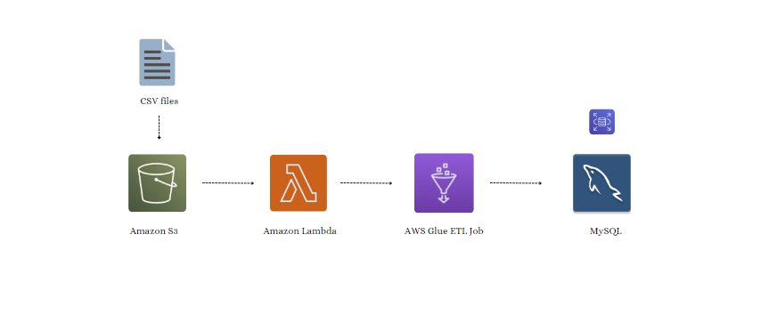
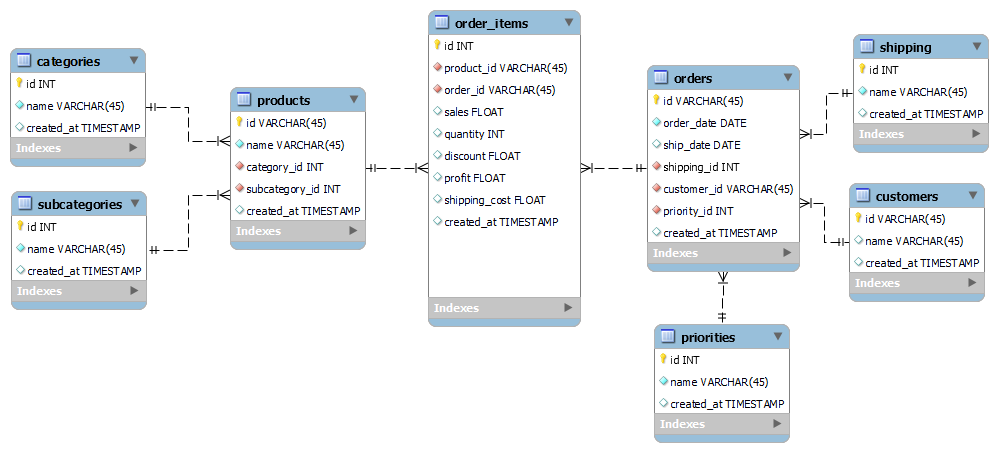

# Event-Driven Serverless ETL Pipeline on AWS
This project aimed to utilize AWS services to create an ETL (Extract, Transform, Load) process, responsible for retrieving data from an S3 bucket, transforming it into a normalized data warehouse format, and loading it into a MySQL database.

## Project Overview
Key components and steps involved in this project include:

1. AWS S3 
2. AWS lambda and event notification
3. AWS glue job
4. Data transformation to 3NF
5. MySQL database

## Data Pipeline

## Data Structure
The dataset used in this project was the Kaggle [Global Super Store Dataset](https://www.kaggle.com/datasets/apoorvaappz/global-super-store-dataset?resource=download), a mock dataset designed to mimic online orders. A [Python script]() was created to divide the dataset into three CSV files to enable the pipeline tests.

### Assumptions
- Only unaltered structure CSV files are uploaded to the S3 bucket.
- Only one CSV file is uploaded at a time.

### ER for the Final Data Warehouse

## Project Steps
1. Setting up the Data Sample
  
	A [Python script]() was created to split the [Global Super Store Dataset](https://www.kaggle.com/datasets/apoorvaappz/global-super-store-dataset?resource=download) into 5 files for testing the pipeline. The datasets were added to the data/datasets path.
2. Setting up S3
   
	A bucket called superstore-ingestion was created to store raw data files. This bucket served as the initial data source for the ETL pipeline.
3. Setting up a MySQL Database with RDS
   
	A MySQL database named superstore was set up to serve as the destination for the transformed data. The database schema was designed to accommodate the normalized data structure, ensuring efficient storage and retrieval of information. The tables were created by forward engineering the entity relationship diagram ([SQL script]()). 
4. Setting up Glue

	An AWS Glue job was created from a [Python script]() to handle the data extraction, transformation, and loading processes. The job retrieved the raw data from the S3 bucket, applied necessary transformations to normalize the data into a structured format suitable for a data warehouse, and then loaded the transformed data into a MySQL database hosted on Amazon RDS.
5. Setting up Lambda
   
	A [Lambda script]() was created to initialize the ETL every time a new file is added to the bucket by invoking the AWS Glue job. AWS S3 Event Notifications were set up to trigger an AWS Lambda function whenever a new file was uploaded to the S3 bucket.
6. Testing the Pipeline
   
	One file from data/datasets was added at a time to the S3 bucket to test the pipeline.

## Extras
- Sync between GitHub and AWS S3 bucket with GitHub Actions

## References
- [Build an ETL service pipeline to load data incrementally from Amazon S3 to Amazon Redshift using AWS Glue](https://docs.aws.amazon.com/prescriptive-guidance/latest/patterns/build-an-etl-service-pipeline-to-load-data-incrementally-from-amazon-s3-to-amazon-redshift-using-aws-glue.html)
- [Set up the AWS CLI](https://docs.aws.amazon.com/cli/latest/userguide/getting-started-quickstart.html)
- [S3 Client](https://boto3.amazonaws.com/v1/documentation/api/latest/reference/services/s3.html)
- [Connecting to MySQL Using Connector/Python](https://dev.mysql.com/doc/connector-python/en/connector-python-example-connecting.html) 
- [Tutorial: Writing an AWS Glue for Spark script](https://docs.aws.amazon.com/glue/latest/dg/aws-glue-programming-intro-tutorial.html)
- [GitHub Action to Sync S3 Bucket](https://github.com/jakejarvis/s3-sync-action)